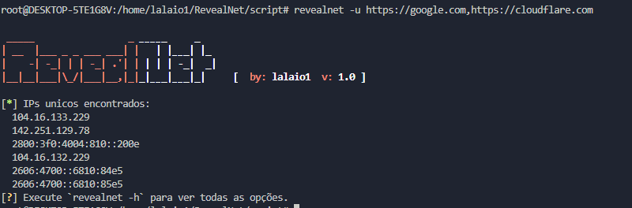
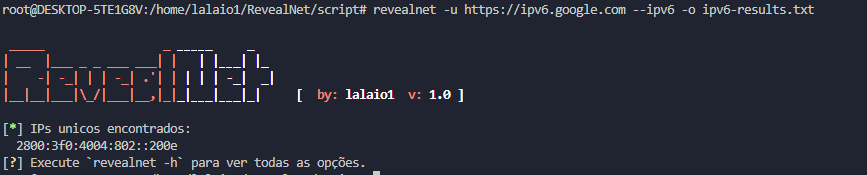

# 🔍 RevealNet 🌐

RevealNet é uma ferramenta de resolução de IPs a partir de URLs com recursos avançados para segurança e análise de rede.


---

## ⚡ Características Principais

- ✅ Resolução de múltiplas URLs para IPs únicos
- 🧅 Suporte integrado à rede Tor para anonimidade
- 🛡️ Detecção e filtragem de IPs do CloudFlare
- 🔄 Suporte para IPv6
- 📁 Entrada e saída em arquivos de texto
- 📊 Modo verboso para análise detalhada

---

## 📥 Instalação

### Método Rápido (Recomendado)

```bash
curl -sSL https://raw.githubusercontent.com/lalaio1/RevealNet/refs/heads/main/script/install.sh -o install.sh
chmod +x install.sh
./install.sh
rm install.sh
```

### Instalação Manual

Clone o repositório:
```bash
git clone https://github.com/lalaio1/RevealNet.git
cd RevealNet
cargo build --release
cp target/release/revealnet /usr/local/bin/
```

---

## 🚀 Uso

### Tabela de Argumentos

| Argumento | Forma curta | Forma longa | Descrição |
|-----------|-------------|-------------|-----------|
| Lista de URLs | `-l` | `--list` | Arquivo com lista de URLs para resolução |
| URLs diretas | `-u` | `--urls` | Lista de URLs separadas por vírgula |
| Arquivo de saída | `-o` | `--output-list` | Arquivo para salvar a lista de IPs encontrados |
| Usar Tor | `-t` | `--tor` | Resolve URLs através da rede Tor |
| Modo verboso | `-v` | `--verbose` | Exibe informações detalhadas durante a execução |
| Filtrar CloudFlare | | `--no-cloudflare` | Ignora IPs pertencentes ao CloudFlare |
| Usar IPv6 | | `--ipv6` | Habilita resolução de endereços IPv6 |
| Ajuda | `-h` | `--help` | Exibe informações de ajuda |
| Versão | | `--version` | Exibe a versão da ferramenta |

---

## 📋 Exemplos de Uso

### 1. Resolução básica de URLs
```bash
revealnet -u example.com,google.com,cloudflare.com
```



### 2. Usando arquivo de entrada e saída
```bash
revealnet -l urls.txt -o resultados.txt
```

### 3. Resolução anônima com Tor
```bash
revealnet -l alvos.txt -t -v
```

### 4. Filtrando IPs do CloudFlare com modo verboso
```bash
revealnet -u cloudflare.com,google.com --no-cloudflare -v
```

### 5. Capturando endereços IPv6
```bash
revealnet -u ipv6.google.com --ipv6 -o ipv6-results.txt
```



---

## ❓ Solução de Problemas

### Erro de Resolução
Se as URLs não estão sendo resolvidas:
1. Verifique sua conexão com a internet
2. Confirme se as URLs estão no formato correto (com http:// ou https://)
3. Verifique as permissões de escrita ao usar a opção de arquivo de saída

---

## 🌟 Contribuição

Contribuições são bem-vindas! Sinta-se à vontade para:
- Reportar bugs
- Sugerir melhorias
- Enviar pull requests

---

## 📞 Contato

Para suporte ou sugestões, entre em contato:
- Telegram: [https://t.me/lalaio1](https://t.me/lalaio1)
- GitHub: [lalaio1](https://github.com/lalaio1)

---

## 📜 Licença

Este projeto está licenciado sob a licença MIT - veja o arquivo LICENSE para mais detalhes.

---

⚠️ **Aviso Legal**: Esta ferramenta foi desenvolvida para fins educacionais e de pesquisa em segurança. O uso indevido para atividades maliciosas é de inteira responsabilidade do usuário.
